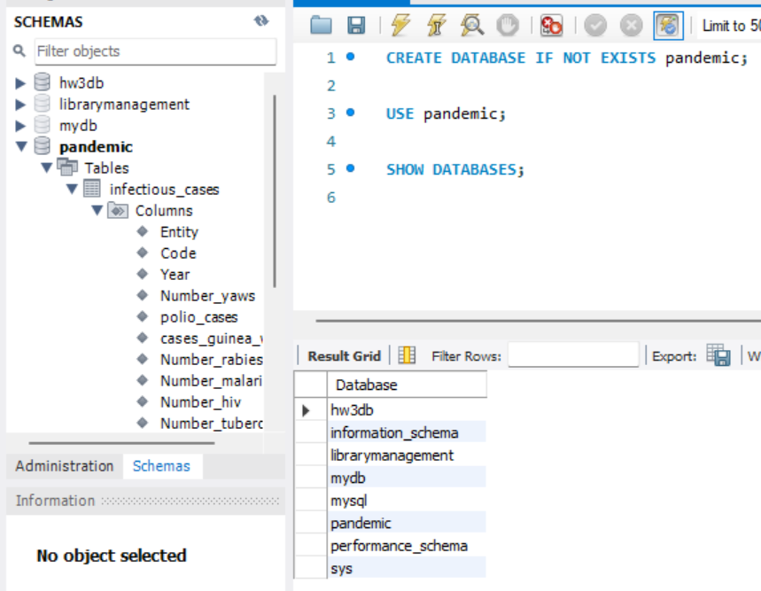

# goit-rdb-fp

## Step 1.

**1. Created a new database named "pandemic" to store the data for the project.**

**2. Used the "pandemic" database as the default database for the project.**

**3. Refreshed the list of databases used in the project to include the new "pandemic" database.**

**4. Used the Import Wizard to import any data required for the project into the "pandemic" database.**

```sql
CREATE DATABASE IF NOT EXISTS pandemic;

USE pandemic;

SHOW DATABASES;
```



---

## Step 2.

**1. **

**2. **

**3. **

```sql
SELECT 'Entity' AS case_type, COUNT(*) AS count
FROM infectious_cases
WHERE Entity = ''

UNION ALL

SELECT 'Code' AS case_type, COUNT(*) AS count
FROM infectious_cases
WHERE Code = ''

UNION ALL

SELECT 'Year' AS case_type, COUNT(*) AS count
FROM infectious_cases
WHERE Year = '';
```


```sql
SELECT 'Number_cholera_cases' AS case_type, COUNT(*) AS count
FROM infectious_cases
WHERE Number_cholera_cases = ''

UNION ALL

SELECT 'polio_cases', COUNT(*)
FROM infectious_cases
WHERE polio_cases = ''

UNION ALL

SELECT 'cases_guinea_worm', COUNT(*)
FROM infectious_cases
WHERE cases_guinea_worm = ''

UNION ALL

SELECT 'Number_rabies', COUNT(*)
FROM infectious_cases
WHERE Number_rabies = ''

UNION ALL

SELECT 'Number_malaria', COUNT(*)
FROM infectious_cases
WHERE Number_malaria = ''

UNION ALL

SELECT 'Number_hiv', COUNT(*)
FROM infectious_cases
WHERE Number_hiv = ''

UNION ALL

SELECT 'Number_tuberculosis', COUNT(*)
FROM infectious_cases
WHERE Number_tuberculosis = ''

UNION ALL

SELECT 'Number_smallpox', COUNT(*)
FROM infectious_cases
WHERE Number_smallpox = '';
```


```sql
SET SQL_SAFE_UPDATES = 0;

UPDATE infectious_cases
SET 
    Number_yaws = NULL
WHERE Number_yaws = '';

UPDATE infectious_cases
SET 
    polio_cases = NULL
WHERE polio_cases = '';

UPDATE infectious_cases
SET 
    cases_guinea_worm = NULL
WHERE cases_guinea_worm = '';

UPDATE infectious_cases
SET 
    Number_rabies = NULL
WHERE Number_rabies = '';

UPDATE infectious_cases
SET 
    Number_malaria = NULL
WHERE Number_malaria = '';

UPDATE infectious_cases
SET 
    Number_hiv = NULL
WHERE Number_hiv = '';

UPDATE infectious_cases
SET 
    Number_tuberculosis = NULL
WHERE Number_tuberculosis = '';

UPDATE infectious_cases
SET 
    Number_smallpox = NULL
WHERE Number_smallpox = '';

UPDATE infectious_cases
SET 
    Number_cholera_cases = NULL
WHERE Number_cholera_cases = '';

SET SQL_SAFE_UPDATES = 1;
```


```sql
CREATE TABLE countries(
    Country_ID INT AUTO_INCREMENT PRIMARY KEY,
    Country_name VARCHAR(50),
    Country_code VARCHAR(10)
);

INSERT INTO countries(Country_name, Country_code)
SELECT DISTINCT Entity, Code FROM infectious_cases;

SELECT * FROM countries;
```


```sql
CREATE TABLE diseases(Country_ID INT,
                      Year YEAR,
                      Number_yaws FLOAT NULL,
                      Number_polio FLOAT NULL,
                      Number_guinea_worm FLOAT NULL,
                      Number_rabies FLOAT NULL,
                      Number_malaria FLOAT NULL,
                      Number_hiv FLOAT NULL,
                      Number_tuberculosis FLOAT NULL, 
                      Number_smallpox FLOAT NULL,
                      Number_cholera_cases FLOAT NULL,
                      PRIMARY KEY (Country_ID, Year),
                      FOREIGN KEY (Country_ID) REFERENCES countries(Country_ID));

INSERT INTO diseases(Country_ID, Year, Number_yaws,
           Number_polio, Number_guinea_worm,
           Number_rabies, Number_malaria,
           Number_hiv, Number_tuberculosis, 
           Number_smallpox, Number_cholera_cases)
SELECT DISTINCT c.Country_ID, ic.Year, ic.Number_yaws,
                ic.polio_cases, ic.cases_guinea_worm,
                ic.Number_rabies, ic.Number_malaria,
                ic.Number_hiv, ic.Number_tuberculosis,
                ic.Number_smallpox, ic.Number_cholera_cases
FROM infectious_cases AS ic
JOIN countries AS c ON ic.Entity = c.Country_Name;

SELECT * FROM diseases;
```


---
