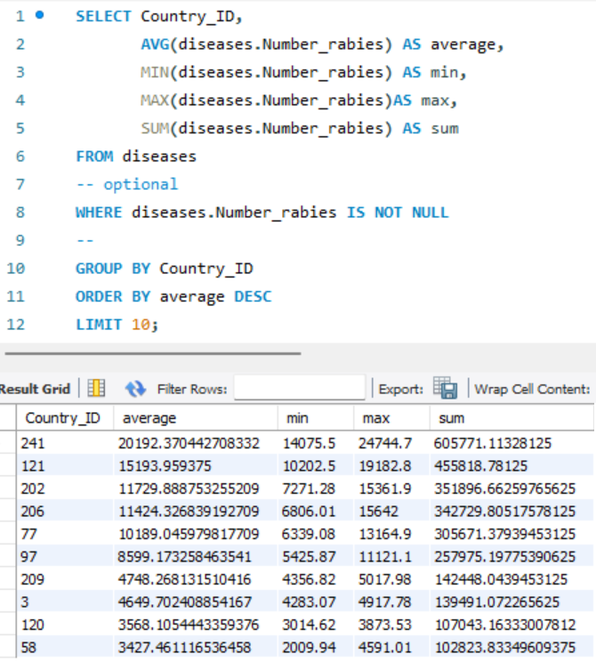

# goit-rdb-fp

## Step 1.

**1. Created a new database named "pandemic" to store the data for the project.**

**2. The "pandemic" database was used as the default database for the project.**

**3. Refreshed the list of databases used in the project to include the new "pandemic" database.**

**4. Used the Import Wizard to import any data required for the project into the "pandemic" database.**

```sql
CREATE DATABASE IF NOT EXISTS pandemic;

USE pandemic;

SHOW DATABASES;
```


---

## Step 2.

**1. The first SQL queries analyze and count the number of empty string values in various columns. This helps identify which attributes need normalization.**

**2. The second set of queries updates columns to replace `''` (empty strings) with `NULL` for easier handling.**

**3. This step creates a normalized table, `countries`, containing unique `Country_Name` and `Country_Code` pairs extracted from `infectious_cases`.**

**4. This table establishes the relationship between a `Country_ID` and a specific year. The disease statistics are added as columns, with all values normalized to reference the primary key combination (`Country_ID`, `Year`).**

**5. This step inserts data into the `diseases` table by joining `infectious_cases` with `countries` on `Country_Name`. This ensures each record is tied to a valid `Country_ID`.**

**_Key Points_**

- Replacing empty strings with `NULL` ensures proper handling in SQL operations.
- `PRIMARY KEY (Country_ID, Year)` ensures no duplicate records for the same country and year. Since the combination of `Country_ID` and `Year` is sufficient to identify a row uniquely, there's no need to introduce an artificial auto-increment ID for this table. This minimizes redundancy and simplifies the schema.

```sql
SELECT 'Entity' AS case_type, COUNT(*) AS count
FROM infectious_cases
WHERE Entity = ''

UNION ALL

SELECT 'Code' AS case_type, COUNT(*) AS count
FROM infectious_cases
WHERE Code = ''

UNION ALL

SELECT 'Year' AS case_type, COUNT(*) AS count
FROM infectious_cases
WHERE Year = ''

UNION ALL

SELECT 'Number_cholera_cases' AS case_type, COUNT(*) AS count
FROM infectious_cases
WHERE Number_cholera_cases = ''

UNION ALL

SELECT 'polio_cases', COUNT(*)
FROM infectious_cases
WHERE polio_cases = ''

UNION ALL

SELECT 'cases_guinea_worm', COUNT(*)
FROM infectious_cases
WHERE cases_guinea_worm = ''

UNION ALL

SELECT 'Number_rabies', COUNT(*)
FROM infectious_cases
WHERE Number_rabies = ''

UNION ALL

SELECT 'Number_malaria', COUNT(*)
FROM infectious_cases
WHERE Number_malaria = ''

UNION ALL

SELECT 'Number_hiv', COUNT(*)
FROM infectious_cases
WHERE Number_hiv = ''

UNION ALL

SELECT 'Number_tuberculosis', COUNT(*)
FROM infectious_cases
WHERE Number_tuberculosis = ''

UNION ALL

SELECT 'Number_smallpox', COUNT(*)
FROM infectious_cases
WHERE Number_smallpox = '';
```


```sql
SET SQL_SAFE_UPDATES = 0;

UPDATE infectious_cases
SET Number_yaws = NULL
WHERE Number_yaws = '';

UPDATE infectious_cases
SET polio_cases = NULL
WHERE polio_cases = '';

UPDATE infectious_cases
SET cases_guinea_worm = NULL
WHERE cases_guinea_worm = '';

UPDATE infectious_cases
SET Number_rabies = NULL
WHERE Number_rabies = '';

UPDATE infectious_cases
SET Number_malaria = NULL
WHERE Number_malaria = '';

UPDATE infectious_cases
SET Number_hiv = NULL
WHERE Number_hiv = '';

UPDATE infectious_cases
SET Number_tuberculosis = NULL
WHERE Number_tuberculosis = '';

UPDATE infectious_cases
SET Number_smallpox = NULL
WHERE Number_smallpox = '';

UPDATE infectious_cases
SET Number_cholera_cases = NULL
WHERE Number_cholera_cases = '';

SET SQL_SAFE_UPDATES = 1;
```


```sql
CREATE TABLE countries(
    Country_ID INT AUTO_INCREMENT PRIMARY KEY,
    Country_name VARCHAR(50),
    Country_code VARCHAR(10)
);

INSERT INTO countries(Country_name, Country_code)
SELECT DISTINCT Entity, Code FROM infectious_cases;

SELECT * FROM countries;
```


```sql
CREATE TABLE diseases(Country_ID INT,
                      Year YEAR,
                      Number_yaws FLOAT NULL,
                      Number_polio FLOAT NULL,
                      Number_guinea_worm FLOAT NULL,
                      Number_rabies FLOAT NULL,
                      Number_malaria FLOAT NULL,
                      Number_hiv FLOAT NULL,
                      Number_tuberculosis FLOAT NULL,
                      Number_smallpox FLOAT NULL,
                      Number_cholera_cases FLOAT NULL,
                      PRIMARY KEY (Country_ID, Year),
                      FOREIGN KEY (Country_ID) REFERENCES countries(Country_ID));

INSERT INTO diseases(Country_ID, Year, Number_yaws,
           Number_polio, Number_guinea_worm,
           Number_rabies, Number_malaria,
           Number_hiv, Number_tuberculosis,
           Number_smallpox, Number_cholera_cases)
SELECT DISTINCT c.Country_ID, ic.Year, ic.Number_yaws,
                ic.polio_cases, ic.cases_guinea_worm,
                ic.Number_rabies, ic.Number_malaria,
                ic.Number_hiv, ic.Number_tuberculosis,
                ic.Number_smallpox, ic.Number_cholera_cases
FROM infectious_cases AS ic
JOIN countries AS c ON ic.Entity = c.Country_Name;

SELECT * FROM diseases;
```


---

## Step 3.

**1. Calculated the average, minimum, maximum, and sum of the attribute `Number_rabies` for `Country_ID`s.**

**2. Excluded any records where `Number_rabies` is empty (`''`).**

**3. Then, sorted the results by the calculated average in descending order and limited the output to 10 rows.**

```sql
SELECT Country_ID,
       AVG(diseases.Number_rabies) AS average,
       MIN(diseases.Number_rabies) AS min,
       MAX(diseases.Number_rabies)AS max,
       SUM(diseases.Number_rabies) AS sum
FROM diseases
-- optional
WHERE diseases.Number_rabies IS NOT NULL
--
GROUP BY Country_ID
ORDER BY average DESC
LIMIT 10;
```



---

## Step 4.

**1. Created a column that generates the first day of the year based on the `Year` column.**

**2. Created a column that holds the current date.**

**3. Created a column that calculates the difference in years between the two above-mentioned columns.**

```sql
WITH TemporalTable AS (
     SELECT Year,
            STR_TO_DATE(CONCAT(Year, '-01-01'), '%Y-%m-%d')
                AS january_first_year,
		    CURDATE() AS current_date_value
     FROM diseases
)
    SELECT Year,
        january_first_year,
        current_date_value,
        TIMESTAMPDIFF(YEAR, january_first_year, current_date_value)
            AS years_diff
    FROM TemporalTable;
```


---

## Step 5.1

**This step involves creating a user-defined function in MySQL, `YearsDifference`, which calculates the difference in years between the current date and the first day of the given year. The function takes a `YEAR` value as input, constructs a date for January 1st of that year, and then calculates the difference in years using the `TIMESTAMPDIFF` function.**

```sql
DROP FUNCTION IF EXISTS YearsDifference;
DELIMITER //
CREATE FUNCTION YearsDifference (yearValue YEAR)
RETURNS INT
DETERMINISTIC
BEGIN
    DECLARE january_first_year DATE;
    DECLARE current_date_value DATE;

	SET january_first_year = STR_TO_DATE(CONCAT(yearValue, '-01-01'), '%Y-%m-%d');
    SET current_date_value = CURDATE();

	RETURN TIMESTAMPDIFF(YEAR, january_first_year, current_date_value);
END //
DELIMITER ;

SELECT Year, YEAR(CURDATE()) AS current_year,
       YearsDifference(Year) AS years_diff
FROM diseases
```


---

## Step 5.2

**The SQL code you've provided is attempting to create a function called `DiseasesPerPeriod`, which calculates the average number of diseases over a specific period (month, quarter, etc.) based on the number of diseases in a year and the period divider.**

```sql
DROP FUNCTION IF EXISTS DiseasesPerPeriod;
DELIMITER //
CREATE FUNCTION DiseasesPerPeriod (diseasesNumber FLOAT, periodDivider INT)
RETURNS FLOAT
DETERMINISTIC
BEGIN
    IF diseasesNumber IS NULL THEN
        RETURN 0;
    ELSE
        IF periodDivider > 12 OR periodDivider < 1 THEN
			RETURN 0;
        ELSE
            RETURN ROUND(diseasesNumber / periodDivider, 2);
        END IF;
    END IF;
END //
DELIMITER ;
```

```sql
SELECT YEAR, Number_rabies,
       DiseasesPerPeriod(Number_rabies, 2) AS semiannual,
       DiseasesPerPeriod(Number_rabies, 3) AS quarterly,
       DiseasesPerPeriod(Number_rabies, 12) AS monthly,
       DiseasesPerPeriod(Number_rabies, 13) AS invalid_period,
       YEAR, Number_tuberculosis,
       DiseasesPerPeriod(Number_tuberculosis, 2) AS semiannual,
       DiseasesPerPeriod(Number_tuberculosis, 3) AS quarterly,
       DiseasesPerPeriod(Number_tuberculosis, 12) AS monthly,
       DiseasesPerPeriod(Number_tuberculosis, 13) AS invalid_period
FROM diseases
```


